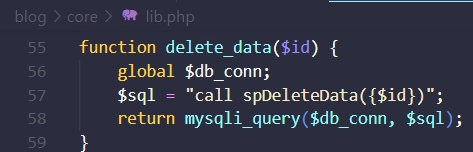
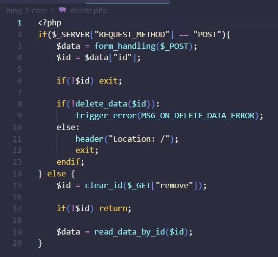

# Для запуска:
    php -S localhost:80 -t .

# Всячина:
1. Код для удаления записи:
 

 

Для полной работы удаления создал шаблон и html из файла админа тоже добавил в шаблон. Добавил файл `delete.php` для работы функционала удаления. Работает аналогично файлу `update.php`.
3. Убирание ссылок у блога:
Просто добавил новый шаблон ссылками и вставлял его в старый шаблон, если пользователь был админом.
